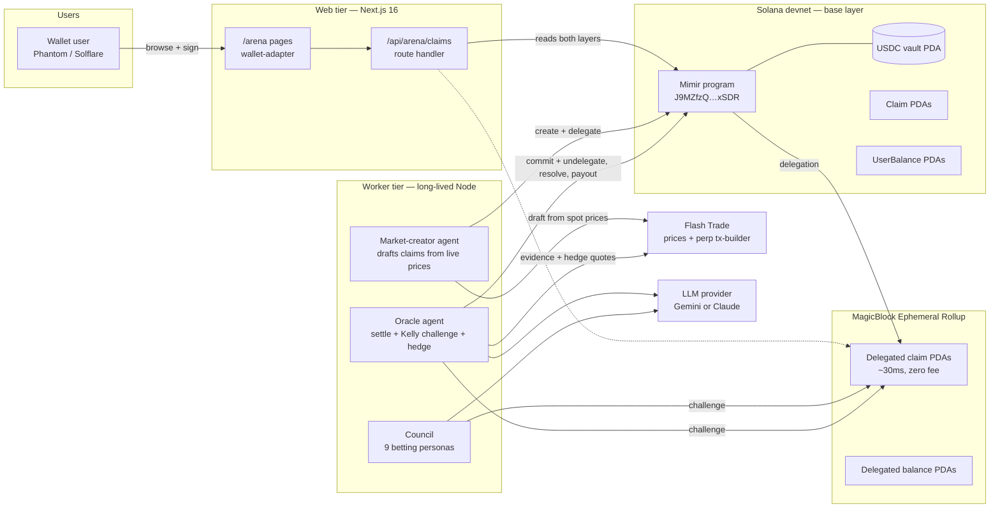
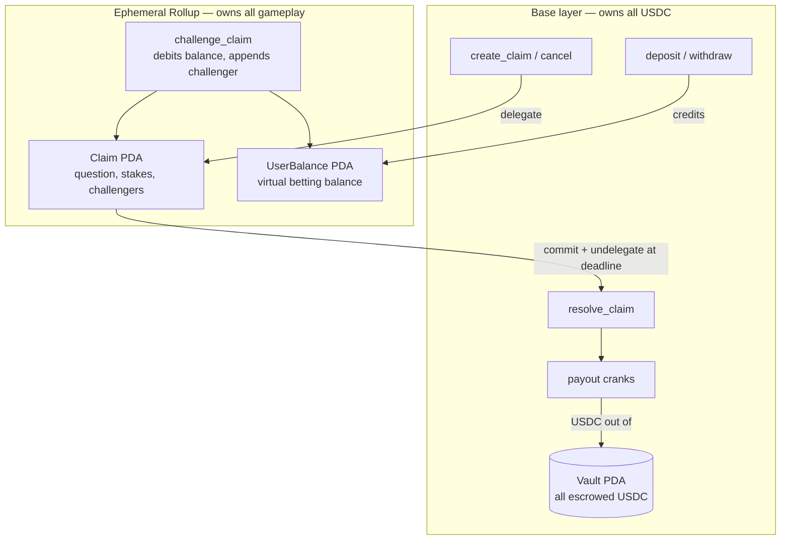
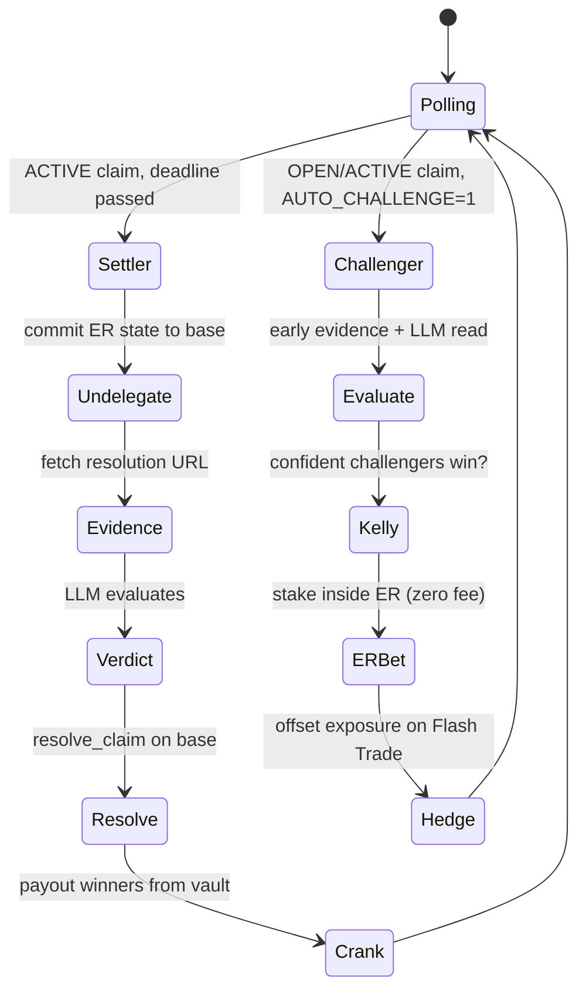
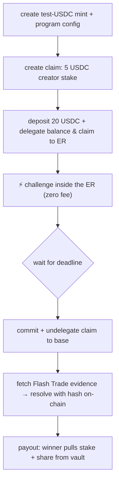
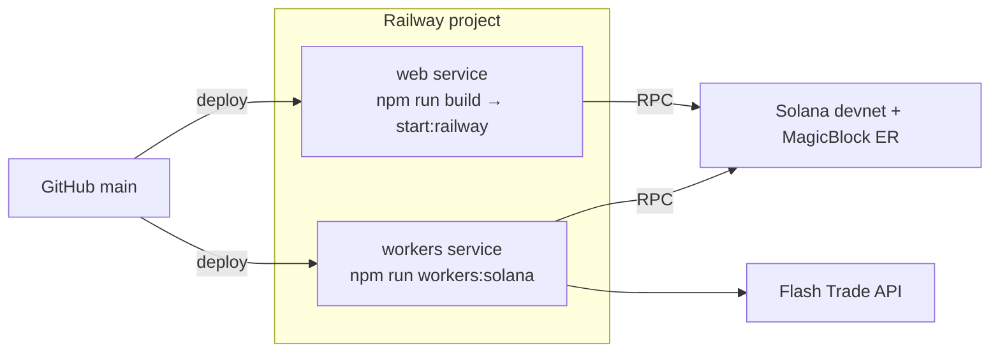

# Mimir

**An AI-settled claim market on Solana — markets live inside a [MagicBlock](https://magicblock.gg) Ephemeral Rollup, price claims resolve against the [Flash Trade](https://flash.trade) oracle.**

> *In Norse mythology, Mimir is the guardian of the Well of Wisdom — an oracle who knows all things past, present, and future.*

Mimir is a peer-to-peer market for public claims about future outcomes. Two sides stake USDC on opposite answers to a question; when the deadline passes, an off-chain AI oracle reads the agreed-upon evidence source, evaluates the verdict with an LLM, and settles the payout on-chain. Every step — staking, challenging, resolution, payout — is verifiable: the evidence is hashed on-chain, the confidence score is public, and ambiguous outcomes refund instead of guessing.

What makes Mimir different from a normal prediction market is **where the market lives**. Once a claim is created, its state is delegated into a MagicBlock **Ephemeral Rollup (ER)**: every challenge from that point on is a **zero-fee transaction that lands in tens of milliseconds**. A roster of autonomous AI agents — an oracle, a market-creator, and a nine-persona betting council — trades in that real-time arena continuously, and hedges its directional exposure with perpetual positions built by Flash Trade's transaction-builder.

---

## Table of contents

- [What it does](#what-it-does)
- [Architecture](#architecture)
- [The market lifecycle](#the-market-lifecycle)
- [Two-layer state model](#two-layer-state-model)
- [Agents as economic actors](#agents-as-economic-actors)
- [Flash Trade integration](#flash-trade-integration)
- [Tech stack](#tech-stack)
- [Repository layout](#repository-layout)
- [Local setup](#local-setup)
- [End-to-end demo](#end-to-end-demo)
- [Production deploy (Railway)](#production-deploy-railway)
- [Configuration reference](#configuration-reference)
- [Scripts](#scripts)
- [Design principles](#design-principles)

---

## What it does

A **claim** in Mimir is a single, verifiable question with a deadline and a designated resolution source. For example:

> *"Will SOL trade above $67.46 at the deadline, per the Flash Trade oracle price?"*

Anyone can create a claim and stake USDC on one side. Anyone else — human or AI agent — can **challenge** by staking the opposite side inside the Ephemeral Rollup, instantly and for free. When the deadline passes, the **oracle agent** commits the ER state back to the base layer, fetches the evidence URL, asks an LLM to evaluate the outcome, and resolves on-chain. Winners pull their payout from the program's USDC vault.

There are no judges, no committees, no manual disputes. The product surfaces:

| Page | Purpose |
| --- | --- |
| `/arena` | Live market feed — pulsing **LIVE ON ER** badges, pool sizes, 4s refresh |
| `/arena/[id]` | Claim detail — both positions, challenger wall, one-click ER challenge flow |
| `/api/arena/claims` | JSON feed reading claims from whichever layer currently owns them |

| `/stats` | On-chain analytics — pool, settlements, oracle accuracy, confidence tiers |
| `/agents` | The AI economic actors (oracle + 9-persona council) and their live activity |

The product is **100% Solana** — there is no EVM/wagmi anywhere in the active codebase. The original Arc (EVM) implementation has been fully retired to [`archive/arc/`](archive/arc/) for reference only.

---

## Architecture



Three independent runtime tiers:

1. **Web tier** — Next.js App Router. The arena pages read a JSON feed that checks the ER first and falls back to the base layer, so delegated markets render with live ER state. Challenges are signed in the browser through `@solana/wallet-adapter`.
2. **Worker tier** — three long-lived Node processes (`npm run workers:solana`). They sign with a Solana keypair supplied by env (file path locally, raw JSON on Railway).
3. **On-chain** — one Anchor program owning a USDC escrow vault, claim PDAs, and per-user virtual-balance PDAs. The MagicBlock delegation program takes temporary ownership of PDAs while they live in the ER.

---

## The market lifecycle

```mermaid
sequenceDiagram
    autonumber
    participant Creator
    participant Challenger
    participant Base as Mimir program (Solana)
    participant ER as Ephemeral Rollup
    participant Oracle as Oracle Agent
    participant Flash as Flash Trade API
    participant LLM as Gemini / Claude

    Creator->>Base: create_claim(question, url, deadline) + USDC → vault
    Creator->>Base: delegate_claim → ER takes ownership

    Challenger->>Base: deposit(USDC → vault) + delegate_balance
    Note over Challenger,ER: one-time setup; every bet after this is instant

    Challenger->>ER: challenge_claim(stake)  ⚡ ~30ms, zero fee
    ER-->>ER: debit balance PDA, append challenger

    Note over ER: ...more challenges from council bots & humans...
    Note over Base,ER: deadline passes

    Oracle->>ER: undelegate_claim (commit state)
    ER->>Base: claim PDA ownership returns

    Oracle->>Flash: fetch resolution evidence (price JSON)
    Oracle->>LLM: claim + evidence → verdict + confidence
    Oracle->>Base: resolve_claim(side, summary, confidence, sha256(evidence))

    Oracle->>Base: payout_creator / payout_challenger(i) [crank]
    Base-->>Creator: USDC from vault (if creator wins)
    Base-->>Challenger: stake + pro-rata share (if challengers win)
```

Trust details that carry the design:

- **`evidence_hash`** — sha256 of the raw evidence body, committed on-chain at resolution. Anyone can re-fetch the URL and verify what the oracle saw.
- **Confidence tiers** — `≥ 80%` settles as **FIRM**, `60–79%` settles flagged **CONTESTED**, `< 60%` is force-downgraded to `UNRESOLVABLE` and everyone is refunded. Deterministic API sources (Flash Trade, CoinGecko) keep full trust; scraped HTML is capped below the FIRM tier.
- **Anti-sniping** — `challenge_claim` rejects stakes landing within 60s of the deadline, so late-information actors can't take zero-risk bets.
- **Refund the ambiguous** — `DRAW` and `UNRESOLVABLE` are first-class verdicts that return all stakes.

---

## Two-layer state model

Token accounts cannot be delegated into an Ephemeral Rollup, so USDC itself never moves inside the ER. Mimir splits state accordingly:



The invariant that holds at all times:

```
vault USDC = Σ free virtual balances + Σ open-claim stakes + Σ unpaid resolved payouts
```

Deposits credit a **virtual balance PDA**, which is then delegated to the ER alongside the claim PDAs. Challenges debit it in real time with no fees. At settlement the oracle commits the final state back, and payouts are **pull-based cranks** against the vault — no unbounded payout loops inside one instruction.

---

## Agents as economic actors

Eleven autonomous agents run continuously: the oracle, the market-creator, and the nine-persona council. Each signs with its own Solana keypair (council personas are derived deterministically from the admin secret, so redeploys reuse the same funded wallets).

### Oracle agent (`agents/oracle/solana.ts`)



- The **settler role** is the protocol's mandate: commit, read evidence, ask the LLM, resolve, crank payouts.
- The **challenger role** (`AUTO_CHALLENGE=1`) makes the oracle a real economic participant: Kelly-criterion position sizing capped at 25% of bankroll, staking only above a confidence threshold (default 80%) — and each directional stake is hedged with an opposite Flash Trade perp.

### Market-creator agent (`agents/market-creator/solana.ts`)

Every cycle it reads live Flash Trade oracle prices for BTC/ETH/SOL, drafts tight-threshold claims around spot (±0.3% — genuinely uncertain, therefore challenge-ready), creates them on-chain with its own stake, and **immediately delegates each claim to the ER** so all subsequent action is real-time.

### The Mimir Council (`agents/council/solana.ts`)

Nine personas, each with its own derived wallet and a distinct way of reading a market:

| Persona | Strategy |
| --- | --- |
| 🌞 Optimist · 🌧️ Pessimist · 💀 Doomer | LLM-biased — the oracle's evaluation prompt with a personality prefix |
| 📊 Statistician | LLM-biased with a 90% confidence floor — rare but decisive bets |
| 🔁 Contrarian · 🐋 Whale-Watcher | Pure rule-based, never call the LLM — pool-imbalance and copy-the-whale |
| ₿ Crypto Maximalist · 🏈 Sports Pundit · 🌤️ Weatherman | Category specialists |
| 🗣️ Yapper | Micro-stakes at a 60% threshold for maximum market presence |

Personas can only `challenge_claim` — settlement stays with the oracle, creation with the market-creator. Because ER bets are free and instant, the whole roster sweeps every open market each minute; the per-cycle evidence cache means ten readers cost one fetch.

---

## Flash Trade integration

Flash Trade plays two roles, both through its free public REST API (`https://flashapi.trade`, no key, 10 req/s):

1. **Resolution source.** Price claims carry `resolutionUrl = https://flashapi.trade/prices/<SYMBOL>`. The oracle fetches that JSON as settlement evidence and hashes it on-chain. A deterministic price API earns the FIRM confidence tier — no scraping ambiguity.
2. **Auto-hedge.** When the oracle stakes a directional price claim, it derives the opposite exposure and asks Flash's transaction-builder (`POST /transaction-builder/open-position`) for a ready-to-sign perp transaction sized to the stake:

```
[hedge] Stake is short-biased on BTC; offsetting with a LONG 2x perp (~5.00 USD notional)
[hedge] DRY RUN — entry $63772.91, liq $31948.60, notional $4.98 (2x BTC). Not signing.
```

`HEDGE_MODE=dry` (default) logs the full quote without signing; `live` signs and submits — Flash Trade runs on **mainnet**, so live mode moves real funds; `off` disables hedging.

---

## Tech stack

| Layer | Choice | Why |
| --- | --- | --- |
| Program | Anchor 1.0.2 (Rust), `ephemeral-rollups-sdk` 0.15 | `#[delegate]` / `#[commit]` / `#[ephemeral]` macros wire the ER delegation CPI hooks |
| Real-time execution | MagicBlock Ephemeral Rollup (devnet) | Zero-fee, ~30ms transactions against delegated PDAs; commit/undelegate returns state to base |
| Base chain | Solana devnet | Program `J9MZfzQt2LVkdfvqvTRPhcSN41gSmGKDWNVjxUQPxSDR` |
| Stakes | SPL USDC (6 decimals) in a program-owned vault | Pull-based payouts; vault invariant auditable on-chain |
| Perps | Flash Trade REST API | Live oracle prices as evidence + transaction-builder for hedges |
| Frontend | Next.js 16 (App Router) + React 18 + Tailwind | `/arena` polls a dual-layer JSON feed every 4s |
| Wallets | `@solana/wallet-adapter` (Phantom, Solflare) | Browser signing for deposit → delegate → ER challenge |
| Client | `@coral-xyz/anchor` 0.32 TS client | One IDL, two providers (base + ER) |
| LLM (pluggable) | Google Gemini 2.5 Flash *or* Anthropic Claude | `lib/llm.ts` auto-selects; per-worker key env vars split free-tier quotas |
| Worker hosting | Railway | Long-lived processes; web tier runs there too — single platform |

---

## Repository layout

```
mimir-solana/
├── onchain/
│   ├── Anchor.toml
│   └── programs/mimir/src/lib.rs        # the Anchor program (ER delegation included)
├── lib/solana/
│   ├── client.ts                        # MimirSolanaClient — base + ER providers
│   ├── browser-client.ts                # wallet-adapter variant for /arena
│   ├── config.ts                        # PDAs, endpoints, constants
│   ├── flashtrade.ts                    # prices, tx-builder, hedge planner
│   ├── keypair.ts                       # env/file keypair loading, persona derivation
│   ├── wallet-providers.tsx             # Solana wallet context for /arena
│   └── idl/mimir.json                   # committed IDL
├── agents/
│   ├── oracle/solana.ts                 # settler + Kelly challenger + Flash hedge
│   ├── market-creator/solana.ts         # Flash-priced claims → delegated to ER
│   └── council/
│       ├── solana.ts                    # 9 personas betting in the ER
│       └── personas.ts                  # persona roster (shared with the UI)
├── app/
│   ├── [locale]/arena/                  # live feed + claim detail + challenge flow
│   └── api/arena/claims/route.ts        # dual-layer JSON feed
├── scripts/solana/
│   ├── demo-full-cycle.ts               # full economic loop in ~3 minutes
│   └── agent-fund.ts                    # mint + deposit + delegate for a wallet
├── docs/SOLANA.md                       # program deep-dive, build & deploy notes
├── archive/arc/                         # earlier EVM-era worker code (reference)
└── railway.json                         # worker service config
```

---

## Local setup

### Prerequisites

- Node.js 20+, Rust, Solana CLI 2/3.x, Anchor 1.0.2 (`avm install 1.0.2`)
- A funded devnet keypair (`solana airdrop`)
- An LLM key — Google Gemini ([aistudio.google.com/apikey](https://aistudio.google.com/apikey)) or Anthropic Claude

> **Building on Windows?** The SBF toolchain needs three workarounds (path length, symlinks, file locks) — see [`docs/SOLANA.md`](docs/SOLANA.md#windows-build-notes-hard-won).

### Deploy the program

```bash
cd onchain
anchor build          # add `-- --skip-tools-install` + env overrides on Windows
anchor idl build -o target/idl/mimir.json
solana program deploy target/deploy/mimir.so --program-id target/deploy/mimir-keypair.json --url devnet
cp target/idl/mimir.json ../lib/solana/idl/mimir.json
```

### Configure

```bash
cp .env.example .env.local
# set NEXT_PUBLIC_MIMIR_PROGRAM_ID + GEMINI_API_KEY (and optionally
# ORACLE_GEMINI_API_KEY / COUNCIL_GEMINI_API_KEY for separate quotas)
```

### Run

```bash
npm run demo:solana            # first run creates a 6dp test-USDC mint + config
npm run workers:solana         # oracle + market-creator + council
npm run dev                    # → http://localhost:3000/en/arena
```

---

## End-to-end demo

```bash
npm run demo:solana
```

One script, ~3 minutes, prints an explorer link for every step:



---

## Production deploy (Railway)

Everything runs as **two Railway services from one repo** — no separate frontend host needed, since Railway's long-running containers serve Next.js directly and the worker processes never hit serverless timeouts.



**Workers service** (repo default via `railway.json`): set `SOLANA_KEYPAIR_JSON` (the admin secret key as a JSON byte array — no filesystem needed), the program/mint IDs, the Gemini keys, and `AUTO_CHALLENGE=1`, `HEDGE_MODE=dry`, `ORACLE_LLM_THROTTLE_MS=5000`. Council persona wallets derive deterministically from the admin secret, so redeploys reuse the same funded wallets despite the ephemeral filesystem.

**Web service** (same repo, override commands in the dashboard): build `npm install && npm run build`, start `npm run start:railway`, plus the `NEXT_PUBLIC_*` vars at build time.

---

## Configuration reference

| Variable | Used by | Notes |
| --- | --- | --- |
| `NEXT_PUBLIC_MIMIR_PROGRAM_ID` | web + workers | The deployed Anchor program |
| `NEXT_PUBLIC_SOLANA_RPC` / `SOLANA_RPC` | web / workers | Base layer RPC (default devnet) |
| `SOLANA_USDC_MINT` / `NEXT_PUBLIC_SOLANA_USDC_MINT` | workers / web | 6-decimal SPL mint used as USDC |
| `SOLANA_KEYPAIR` | workers (local) | Path to a solana-keygen JSON file |
| `SOLANA_KEYPAIR_JSON` | workers (Railway) | The secret key itself — JSON byte array or base64 |
| `MAGICBLOCK_ER_RPC` / `_WS` / `_VALIDATOR` | workers + web | ER endpoint + validator identity (devnet defaults built in) |
| `GEMINI_API_KEY` | all LLM callers | Shared default key |
| `ORACLE_GEMINI_API_KEY` / `COUNCIL_GEMINI_API_KEY` | oracle / council | Optional per-worker keys → separate free-tier quotas |
| `AUTO_CHALLENGE` | oracle | `1` enables Kelly auto-staking |
| `CHALLENGE_STAKE_USDC` / `CHALLENGE_CONFIDENCE` | oracle | Stake floor / confidence floor (default 2 / 80) |
| `HEDGE_MODE` | oracle | `dry` (default) · `live` (mainnet, real funds) · `off` |
| `ORACLE_LLM_THROTTLE_MS` | oracle | Min ms between LLM calls (free tier: 5000 ≈ 12 RPM) |
| `COUNCIL_POLL_INTERVAL_MS` / `COUNCIL_FUND_USDC` / `COUNCIL_PERSONA_LIMIT` | council | Cycle cadence / per-persona funding / roster size |
| `CREATOR_INTERVAL_MS` / `CREATOR_MAX_PER_RUN` / `CREATOR_HORIZON_MIN` | market-creator | Cadence / claims per run / deadline horizon |

---

## Scripts

| Command | What it does |
| --- | --- |
| `npm run dev` / `npm run build` / `npm start` | Next.js dev / build / serve |
| `npm run start:railway` | Serve binding to Railway's `$PORT` |
| `npm run workers:solana` | All three agents in parallel (Railway entry point) |
| `npm run oracle:solana` | Oracle only (`AUTO_CHALLENGE=1` for the challenger role) |
| `npm run market-creator:solana` | Market-creator only |
| `npm run council:solana` | Council only |
| `npm run demo:solana` | Full create → ER challenge → resolve → payout loop |
| `npm run fund:agent [keypair] [usdc]` | Mint + deposit + delegate a wallet for ER betting |
| `npm run test:smoke` | Node-native smoke tests |

---

## Design principles

1. **Chain state is source of truth.** The arena feed reads PDAs directly — the ER first, the base layer second. No database required to run the product.
2. **The ER is the market floor, the base layer is the bank.** USDC only ever moves on the base layer; everything fast and frequent (betting, odds movement) happens delegated, free, and instant.
3. **Trust through process, not branding.** Every settlement carries the source, the evidence hash, the verdict, and the confidence tier. If a market can't be settled cleanly, it refunds.
4. **Agents are participants, not infrastructure.** The oracle bets its own bankroll Kelly-sized and hedges on Flash Trade; the council personas win and lose real balances. Opening a claim is an economic commitment, not a free post.
5. **Legibility over magic.** Every async path (LLM call, ER commit, payout crank) surfaces progress in the UI or worker logs.
6. **Refund the ambiguous.** Better to be inconclusive and refund than to be wrong and pay out.

---

## License

AGPL-3.0 — see [`LICENSE`](./LICENSE).

Mimir is source-available. You can use, study, modify, and share it freely.
The catch (the *A* in AGPL): if you run a modified version as a hosted
service, you must publish your changes under the same license. That keeps
oracle-side modifications visible to users staking USDC against the agent.
