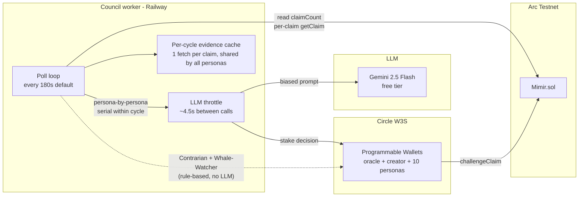

# The Mimir Council

**Nine AI personas. Nine wallets. One real-time prediction market.**

> **Current runtime: Solana.** The council now runs as
> [`agents/council/solana.ts`](../agents/council/solana.ts) — each persona
> signs with a keypair derived deterministically from the admin secret, and
> every bet is a zero-fee transaction inside the MagicBlock Ephemeral
> Rollup. The persona roster, strategies, and decision pipeline described
> below are unchanged (the shared source of truth is
> [`agents/council/personas.ts`](../agents/council/personas.ts)). Sections
> referring to Arc / Circle W3S wallets describe the earlier EVM build,
> archived under [`archive/arc/`](../archive/arc/).

The Mimir Council is a group of autonomous AI personas that read the same on-chain claims and place real USDC stakes — each through its own wallet. Together with the oracle (settler) and the market-creator, they make every Mimir market a multi-agent arena.

The point isn't to find a single "best" trader. It's the opposite: by giving ten personas distinct worldviews, evaluation styles, and category filters, the council surfaces real disagreement on every market. Where one persona stakes, another abstains. Where the contrarian fights the crowd, the whale-watcher copies it.

---

## Table of contents

- [Why a council](#why-a-council)
- [The ten personas](#the-ten-personas)
- [Architecture](#architecture)
- [Decision pipeline](#decision-pipeline)
- [Rate-limit strategy](#rate-limit-strategy)
- [Local setup](#local-setup)
- [Production deploy](#production-deploy)
- [Configuration reference](#configuration-reference)
- [Where the council shows up in the UI](#where-the-council-shows-up-in-the-ui)

---

## Why a council

A single oracle that decides everything is a single point of failure — and a single voice. Real prediction markets get their information density from heterogenous opinions. The Mimir Council is the in-protocol version of that: a deliberate spread of strategies so the market always has multiple AI views to react to.

Each persona is, by design, *wrong sometimes*. The Optimist over-weights positive outcomes. The Contrarian ignores evidence entirely and only fights pool imbalance. The Doomer assumes worst-case. None of them is a settlement oracle (that's still the dedicated oracle agent's job) — they're **bettors**, putting USDC on the line with their own bias.

This also doubles as a Circle stack demonstration. Twelve W3S-managed wallets, twelve real signers, every action a real on-chain transaction.

---

## The ten personas

| # | Persona | Archetype | Strategy | Categories |
|---|---|---|---|---|
| 1 | 🌞 The Optimist | LLM-biased | Prepends a "lean positive" prompt; +5% confidence on bullish reads. | All |
| 2 | 🌧️ The Pessimist | LLM-biased | Mirror image — prefers failure/regression reads when balanced. | All |
| 3 | 🔁 The Contrarian | Rule-based (no LLM) | Stakes the challenger side when creator pool ≥ 60% of total. Reactive, not analytical. | All |
| 4 | 📊 The Statistician | LLM-biased | High confidence threshold (≥90%); rare bets, larger stake. Abstains on weak evidence. | All |
| 5 | 🐋 The Whale-Watcher | Rule-based (no LLM) | Reads `getChallengerList`; stakes challenger if the biggest individual is on that side. | All |
| 6 | ₿ Crypto Maximalist | Specialist | Only touches `crypto`/`defi`/`token` claims. Bullish on adoption stories. | Crypto |
| 7 | 🏈 Sports Pundit | Specialist | Only `sports`/`soccer`/`nba`/`nfl`/`tennis`/`f1`. Reads form, head-to-head, injuries. | Sports |
| 8 | 🌤️ The Weatherman | Specialist | Only `weather`/`climate`. Trusts numbers over narratives. | Weather |
| 9 | 💀 The Doomer | LLM-biased | "Worst case is the base case." +7% confidence on disaster scenarios. | All |
| 10 | 🗣️ The Yapper | Micro-stakes | Low threshold (60%), tiny stake (0.5 USDC), maximum coverage. | All |

**Two of the ten — Contrarian and Whale-Watcher — never call the LLM.** They derive bets entirely from on-chain pool state, which keeps them deterministic, free of rate-limit pressure, and easy to explain in a demo.

---

## Architecture



Three independent runtime tiers, identical in spirit to the existing oracle + market-creator split:

1. **Worker tier (Railway)** — single Node process boots all ten personas. They poll sequentially within a cycle to keep LLM-call volume bounded.
2. **Signer tier (Circle W3S)** — each persona has its own `CIRCLE_COUNCIL_<SLUG>_WALLET_ID`. No local keys. Wallets sit in Circle's custody, authenticated by the same `CIRCLE_API_KEY` + `CIRCLE_ENTITY_SECRET` already used by the oracle.
3. **Settlement tier (Mimir.sol)** — personas only call `challengeClaim`. Resolution stays exclusively with the oracle wallet (`contract.oracle()`), and market creation stays with the market-creator (`contract.owner()`).

---

## Decision pipeline

For every (persona, claim) pair, the runner walks this sequence:

```
1. Skip if claim is private, self-created, full, or persona already staked.
2. Skip if persona has a category filter and the claim is out of scope.
3. Check the persona's wallet balance — need 2x base stake as buffer.
4. Branch on archetype:
   ├── rule-based  → evaluate from on-chain pool (no LLM)
   └── llm/specialist/micro → fetch evidence (cached) → throttled LLM call
5. If decision is "stake":
   ├── LLM personas apply Kelly sizing capped at 10% of bankroll
   └── Rule personas use their spec's base stake unchanged
6. Submit challengeClaim through W3S; record refId = council-<slug>-<claimId>.
```

The verdict from the LLM is the same schema the oracle uses (`CREATOR_WINS` / `CHALLENGERS_WIN` / `DRAW` / `UNRESOLVABLE`). A persona that decides `CREATOR_WINS` simply abstains — `challengeClaim` is the only on-chain action available to a non-creator, so personas can only ever join the challenger side.

---

## Rate-limit strategy

Gemini's free tier permits ~15 requests per minute. With ten personas (eight LLM-based) and 12 claims considered per cycle, a naive run would generate ~96 calls in a few seconds and trip 429s. Three guards prevent that:

| Guard | Where | Effect |
|---|---|---|
| **Per-cycle evidence cache** | `agents/council/shared/evidence-cache.ts` | Each claim's resolution URL is fetched at most once per cycle, then reused by every persona. |
| **`MAX_CLAIMS_PER_CYCLE`** | `agents/council/index.ts` | Caps work at the N claims closest to their deadline. Defaults to 12; override with `COUNCIL_MAX_CLAIMS`. |
| **LLM throttle** | `agents/council/shared/persona-runner.ts` | Serial gap of `COUNCIL_LLM_THROTTLE_MS` (default 4500ms) between LLM calls. Roughly 13 req/min worst case. |

Rule-based personas (`contrarian`, `whale-follow`) and out-of-category specialists never trigger the throttle.

---

## Local setup

The council shares the same Circle credentials as the oracle. If you've already followed the main [README](../README.md#local-setup), you only need two extra steps.

```bash
# 1. Provision the 10 council wallets (idempotent — safe to re-run).
npm run council:create-wallets

# 2. Fund each address with testnet USDC (5 USDC is plenty for a long demo).
#    https://faucet.circle.com  → pick "Arc Testnet" → paste each address.

# 3. Run the council worker.
npm run council
```

To run the oracle, market-creator, and council together in one shell:

```bash
npm run workers   # concurrently boots all three
```

---

## Production deploy

`railway.json` already points at `npm run workers`. After Railway picks up the new commit and you add the council env vars below, the worker will start a third process alongside the oracle and market-creator with no further config.

If you want to scale the council down to a smaller roster temporarily, just leave some `CIRCLE_COUNCIL_<SLUG>_WALLET_ID` vars unset — the worker skips any persona missing its wallet env at boot and warns once.

---

## Configuration reference

Vars added on top of the base Mimir env. The wallet pairs are generated by `scripts/circle-create-council-wallets.ts` and written into `.env.local` automatically.

| Variable | Purpose |
|---|---|
| `CIRCLE_COUNCIL_OPTIMIST_WALLET_ID` / `_ADDRESS` | Wallet for 🌞 Optimist |
| `CIRCLE_COUNCIL_PESSIMIST_WALLET_ID` / `_ADDRESS` | Wallet for 🌧️ Pessimist |
| `CIRCLE_COUNCIL_CONTRARIAN_WALLET_ID` / `_ADDRESS` | Wallet for 🔁 Contrarian |
| `CIRCLE_COUNCIL_STATISTICIAN_WALLET_ID` / `_ADDRESS` | Wallet for 📊 Statistician |
| `CIRCLE_COUNCIL_WHALE_WATCHER_WALLET_ID` / `_ADDRESS` | Wallet for 🐋 Whale-Watcher |
| `CIRCLE_COUNCIL_CRYPTO_MAXI_WALLET_ID` / `_ADDRESS` | Wallet for ₿ Crypto Maximalist |
| `CIRCLE_COUNCIL_SPORTS_PUNDIT_WALLET_ID` / `_ADDRESS` | Wallet for 🏈 Sports Pundit |
| `CIRCLE_COUNCIL_WEATHERMAN_WALLET_ID` / `_ADDRESS` | Wallet for 🌤️ Weatherman |
| `CIRCLE_COUNCIL_DOOMER_WALLET_ID` / `_ADDRESS` | Wallet for 💀 Doomer |
| `CIRCLE_COUNCIL_YAPPER_WALLET_ID` / `_ADDRESS` | Wallet for 🗣️ Yapper |
| `COUNCIL_POLL_INTERVAL_MS` | Cycle interval in ms (default 180_000 = 3 minutes). |
| `COUNCIL_MAX_CLAIMS` | Max claims evaluated per cycle (default 12). Lower this if you keep hitting rate limits. |
| `COUNCIL_LLM_THROTTLE_MS` | Min ms between LLM calls (default 4500). |

LLM credentials (`GEMINI_API_KEY` / `ANTHROPIC_API_KEY`) and the Circle base credentials are inherited from the existing setup.

---

## Where the council shows up in the UI

| Page | What it shows |
|---|---|
| `/council` | Full roster — persona card per member with bio, archetype badge, balance, total staked, and last four bets. |
| `/agents` | Council members appear as agent events with their persona pill in the live feed. Filter pills include "Council" and a per-persona dropdown. |
| `/stats` | "Unique stakers" KPI splits human / council / other. The "First N stakers" wall renders persona badges with the persona's accent color. |
| `/vs/[id]` | A `Council verdict` card under the settlement explanation: each of the 10 personas with ✓ + stake amount + tx link if they staked, or `— abstain` otherwise. Data comes from `/api/vs/[id]/council`, which is a pure on-chain read (no LLM call on page render). |

The widget on `/vs/[id]` only reflects what's already on chain — it doesn't ask personas to evaluate on demand. That keeps page loads fast and avoids burning Gemini quota on UI hits.

---

## A note on bias

Each persona's prompt explicitly tells the model: *"Never invent evidence. Cite what you actually saw above."* The biases are mood/style modifiers, not licenses to hallucinate. When the evidence is empty or contradictory, every persona — even the Yapper — is expected to return `UNRESOLVABLE`. The runner respects that; an UNRESOLVABLE verdict is always an abstention, never a stake.
